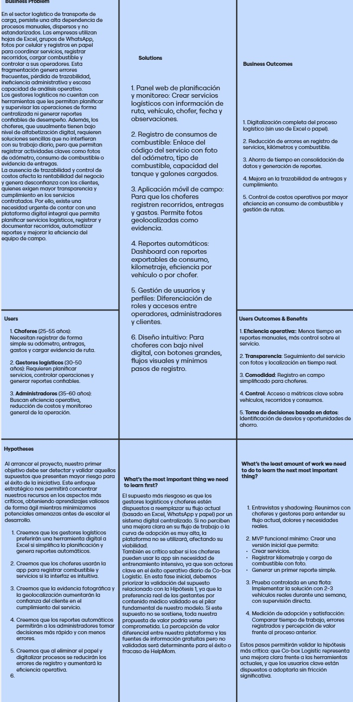

# Informe del Trabajo Final

## Universidad Peruana de Ciencias Aplicadas
### Ingeniería de Software 💻
### Curso: Desarrollo de Aplicaciones Open Source (1ASI0729)
### NRC: 4321
### Docente: Rafael Oswaldo Castro Veramendi
### Startup: CO-BOX LOGISTICS
## CO-BOX LOGISTICS 

* Integrantes

    * Joseph Pablo Rodriguez Parco U202223286
    * Stephano Jose Espinoza Cueva U202218590
    * Merly Salon Puerta U20201b772
    * Angel Guillermo Berrospi Marin U202114701
    * Raul Sanchez Cruz U201518942

<div\>

## Contenido

- [✨ Informe Trabajo Final ✨](#-informe-trabajo-final-)
    - [Universidad Peruana de Ciencias Aplicadas 🎓](#universidad-peruana-de-ciencias-aplicadas-)
  - [Registro de versiones del Informe](#registro-de-versiones-del-informe)
  - [Project Report Collaboration Insights](#project-report-collaboration-insights)
  - [Contenido](#contenido)
  - [Student Outcome](#student-outcome)
- [Capítulo I: Introducción](#capítulo-i-introducción)
  - [1.1. Startup Profile](#11-startup-profile)
    - [1.1.1. Descripción de la Startup](#111-descripción-de-la-startup)
    - [1.1.2 Perfiles de integrantes del equipo](#112-perfiles-de-integrantes-del-equipo)
  - [1.2. Solution Profile](#12-solution-profile)
    - [1.2.1 Antecedentes y problemática](#121-antecedentes-y-problemática)
    - [1.2.2 Lean Ux Process](#122-lean-ux-process)
      - [1.2.2.1. Lean UX Problem Statements](#1221-lean-ux-problem-statements)
      - [1.2.2.2. Lean UX Assumptions](#1222-lean-ux-assumptions)
      - [1.2.2.3. Lean UX Hypothesis Statements](#1223-lean-ux-hypothesis-statements)
      - [1.2.2.4. Lean UX Canvas](#1224-lean-ux-canvas)
  - [Segmentos Objetivos](#segmentos-objetivos)
- [Capítulo II: Requeriments Elicitation \& Analysis](#capítulo-ii-requeriments-elicitation--analysis)
  - [2.1. Competidores](#21-competidores)
    - [2.1.1. Análisis competitivo](#211-análisis-competitivo)
    - [2.1.2. Estrategias y tácticas frente a competidores](#212-estrategias-y-tácticas-frente-a-competidores)
  - [2.2. Entrevistas 📝](#22-entrevistas-)
    - [2.2.1. Diseño de entrevistas](#221-diseño-de-entrevistas)
    - [2.2.2. Registro de entrevistas](#222-registro-de-entrevistas)
    - [2.2.3. Análisis de entrevistas](#223-análisis-de-entrevistas)
  - [2.3. Needfinding](#23-needfinding)
    - [2.3.1. User Personas](#231-user-personas)
    - [2.3.2. User Task Matrix](#232-user-task-matrix)
    - [2.3.3. User Journey Mapping](#233-user-journey-mapping)
    - [2.3.4. Empathy Mapping](#234-empathy-mapping)
    - [2.3.5. As-is Scenario Mapping](#235-as-is-scenario-mapping)
  - [2.4. Ubiquitous Language](#24-ubiquitous-language)
- [Capítulo III: Requeriments Specification](#capítulo-iii-requeriments-specification)
  - [3.1. To-Be Scenario Mapping](#31-to-be-scenario-mapping)
  - [3.2. User Stories](#32-user-stories)
  - [3.3. Impact Mapping](#33-impact-mapping)
  - [3.4. Product Backlog](#34-product-backlog)
- [Capítulo IV: Product Desing](#capítulo-iv-product-desing)
  - [4.1. Style Guidelines](#41-style-guidelines)
    - [4.1.1. General Style Guidelines](#411-general-style-guidelines)
    - [4.1.2. Web Style Guidelines](#412-web-style-guidelines)
  - [4.2. Information Architecture](#42-information-architecture)
    - [4.2.1. Organization Systems](#421-organization-systems)
    - [4.2.2. Labeling Systems](#422-labeling-systems)
    - [4.2.3. SEO Tags and Meta Tags](#423-seo-tags-and-meta-tags)
    - [4.2.4. Searching Systems](#424-searching-systems)
    - [4.2.5. Navigation Systems](#425-navigation-systems)
  - [4.3. Landing Page UI Desing](#43-landing-page-ui-desing)
    - [4.3.1. Landing Page Wireframes](#431-landing-page-wireframes)
    - [4.3.2. Landing Page Mock-Up](#432-landing-page-mock-up)
  - [4.4. Web Applications UX/UI Desing](#44-web-applications-uxui-desing)
    - [4.4.1. Web Applications Wireframes](#441-web-applications-wireframes)
    - [4.4.2. Web Applications Wireflow Diagrams](#442-web-applications-wireflow-diagrams)
    - [4.4.2. Web Applications Mock-ups](#442-web-applications-Mock-ups)
    - [4.4.3. Web Applications User Flow Diagrams](#443-web-applications-user-flow-diagrams)
  - [4.5. Web Applications Prototyping](#45-web-applications-prototyping)
  - [4.6. Domain-Driven Software Architecture](#46-domain-driven-software-architecture)
    - [4.6.1. Software Architecture Context Diagram](#461-software-architecture-context-diagram)
    - [4.6.2. Software Architecture Container Diagram](#462-software-architecture-container-diagram)
    - [4.6.3. Software Architecture Components Diagram](#463-software-architecture-components-diagram)
  - [4.7. Software Object-Oriented Desing](#47-software-object-oriented-desing)
    - [4.7.1. Class Diagram](#471-class-diagram)
    - [4.7.2. Class Dictionary](#472-class-dictionary)
  - [4.8. Database Desing](#48-database-desing)
    - [4.8.1. Database Diagram](#481-database-diagram)
- [Capítulo V: Product Implementation, Validation \& Deployment](#capítulo-v-product-implementation-validation--deployment)
  - [5.1. Software Configuration Management](#51-software-configuration-management)
    - [5.1.1. Software Development Environment Configuration](#511-software-development-environment-configuration)
    - [5.1.2. Source Code Management](#512-source-code-management)
    - [5.1.3. Source Code Style Guide \& Conventions](#513-source-code-style-guide--conventions)
    - [5.1.4. Software Deployment Configuration](#514-software-deployment-configuration)
  - [5.2. Landing Page, Service \& Applications Implementation](#52-landing-page-service--applications-implementation)
    - [5.2.1. Sprint 1](#52x-sprints)
    -  [5.2.1.1. Sprint Planning 1](#5211-Sprint-Planning1)
    -  [5.2.1.2. Aspect Leaders and Collaborators](#5212-Aspect-Leaders-and-Collaborators)
    -  [5.2.1.3. Sprint Backlog 1](#5213-Sprint-Backlog-1)
    -  [5.2.1.4. Development Evidence for Sprint Review](#5214-Development-Evidence-for-Sprint-Review)
    -  [5.2.1.5. Execution Evidence for Sprint Review](#5215-Execution-Evidence-for-Sprint-Review)
    -  [5.2.1.6. Services Documentation Evidence for Sprint Review](#5216-Services-Documentation-Evidence-for-Sprint-Review)
    -  [5.2.1.7. Software Deployment Evidence for Sprint Review](#5217-Software-Deployment-Evidence-for-Sprint-Review)
    -  [5.2.1.8. Team Collaboration Insights during Sprint](#5218-Team-Collaboration-Insights-during-Sprint)
    - [5.2.2. Sprint 2](#53x-sprints)
    -  [5.2.2.1. Sprint Planning 2](#5219-Sprint-Planning1)
    -  [5.2.2.2. Aspect Leaders and Collaborators](#5220-Aspect-Leaders-and-Collaborators)
    -  [5.2.2.3. Sprint Backlog 2](#5221-Sprint-Backlog-1)
    -  [5.2.2.4. Development Evidence for Sprint Review](#5222-Development-Evidence-for-Sprint-Review)
    -  [5.2.2.5. Execution Evidence for Sprint Review](#5223-Execution-Evidence-for-Sprint-Review)
    -  [5.2.2.6. Services Documentation Evidence for Sprint Review](#5224-Services-Documentation-Evidence-for-Sprint-Review)
    -  [5.2.2.7. Software Deployment Evidence for Sprint Review](#5225-Software-Deployment-Evidence-for-Sprint-Review)
    -  [5.2.2.8. Team Collaboration Insights during Sprint](#5226-Team-Collaboration-Insights-during-Sprint)
    - [5.2.3. Sprint 3](#54x-sprints)
    -  [5.2.3.1. Sprint Planning 3](#5227-Sprint-Planning1)
    -  [5.2.3.2. Aspect Leaders and Collaborators](#5228-Aspect-Leaders-and-Collaborators)
    -  [5.2.3.3. Sprint Backlog 3](#5229-Sprint-Backlog-1)
    -  [5.2.3.4. Development Evidence for Sprint Review](#5230-Development-Evidence-for-Sprint-Review)
    -  [5.2.3.5. Execution Evidence for Sprint Review](#5231-Execution-Evidence-for-Sprint-Review)
    -  [5.2.3.6. Services Documentation Evidence for Sprint Review](#5232-Services-Documentation-Evidence-for-Sprint-Review)
    -  [5.2.3.7. Software Deployment Evidence for Sprint Review](#5233-Software-Deployment-Evidence-for-Sprint-Review)
    -  [5.2.3.8. Team Collaboration Insights during Sprint](#5234-Team-Collaboration-Insights-during-Sprint)
    -  [5.3. Validation Interviews](#5235-Validation-Interviews)
    -  [5.3.1. Diseño de Entrevistas](#5236-Diseño-Entrevistas)
    -  [5.3.2. Registro de Entrevistas](#5237-Registro-Entrevistas)
    -  [5.3.3. Evaluaciones según heurísticas](#5238-Evaluaciones-según-heurísticas)
    -  [Conclusiones](#Conclusiones)
    -  [Bibliografía](#Bibliografía)
    -  [Anexos](#Anexos)

# **Registro de Versiones del Informe**

| Versión | Fecha | Autor | Descripción de modificación |
|-----------|-----------|-----------|-----------|
| TB1 | 07/04/2025 | - Angel Guillermo Berrospi    - Joseph Pablo Rodriguez Parco   - Stephano Jose Espinoza Cueva   - Merly Salon Puerta   - Raul Sanchez Cruz | Se han incluído los siguientes puntos:   - Capítulo I: Introducción   - Capítulo II: Requirements Elicitation & Analysis   - Capítulo III: Requirements Specification   - Capítulo IV: Product Design   - Avance del Capítulo V: Product Implementation, Validation & Deployment hasta el punto 5.2.1.8   - Avance de Conclusiones, Bibliografía y Anexos |
| TP1 | 13/05/2025 | - Angel Guillermo Berrospi    - Joseph Pablo Rodriguez Parco   - Stephano Jose Espinoza Cueva   - Merly Salon Puerta   - Raul Sanchez Cruz |  - Avance del Capítulo V: Product Implementation, Validation & Deployment hasta el punto 5.2.2.8   - Avance de Conclusiones, Bibliografía y Anexos |

# **Project Report Collaboration Insights**

URL Project Report (Github): [https://github.com/Cobox-Logistic-OpenSource/upc-pre-2510-daos-4321-grupo3-tp1.git](https://github.com/Cobox-Logistic-OpenSource/upc-pre-2510-daos-4321-grupo3-tp1.git)

# **Student Outcome**

**ABET – EAC - Student Outcome 5**
Criterio: La capacidad de funcionar efectivamente en un equipo cuyos miembros juntos proporcionan liderazgo, crean un entorno de colaboración e inclusivo, establecen objetivos, planifican tareas y cumplen objetivos. 
En el siguiente cuadro se describe las acciones realizadas y enunciados de conclusiones por parte del grupo, que permiten sustentar el haber alcanzado el logro del ABET – EAC - Student Outcome 5. 

### **ABET – EAC - Student Outcome 5**

**Criterio:** La capacidad de funcionar efectivamente en un equipo cuyos miembros juntos proporcionan liderazgo, crean un entorno de colaboración e inclusivo, establecen objetivos, planifican tareas y cumplen objetivos.  
En el siguiente cuadro se describe las acciones realizadas y enunciados de conclusiones por parte del grupo, que permiten sustentar el haber alcanzado el logro del ABET – EAC - Student Outcome 5.

| Criterio específico | Acciones realizadas                                                                                                                                                                                                                                                                                                                                                                                                                                                                                                                                                                                                                                                                                                                                                                                                                                                                                                                                                                                                                                                                                                                                                                                                                                                                                                                                                                                                                                                                                                                                                                                                                                                                                                                                                                                                                                                                                                                                                                                                                                                                                                                                                                                                                                                                                                                                                                                                                                                                                                                                                                                                                                                                                                                                                                                                                             | Conclusiones |
| ------------------- |-------------------------------------------------------------------------------------------------------------------------------------------------------------------------------------------------------------------------------------------------------------------------------------------------------------------------------------------------------------------------------------------------------------------------------------------------------------------------------------------------------------------------------------------------------------------------------------------------------------------------------------------------------------------------------------------------------------------------------------------------------------------------------------------------------------------------------------------------------------------------------------------------------------------------------------------------------------------------------------------------------------------------------------------------------------------------------------------------------------------------------------------------------------------------------------------------------------------------------------------------------------------------------------------------------------------------------------------------------------------------------------------------------------------------------------------------------------------------------------------------------------------------------------------------------------------------------------------------------------------------------------------------------------------------------------------------------------------------------------------------------------------------------------------------------------------------------------------------------------------------------------------------------------------------------------------------------------------------------------------------------------------------------------------------------------------------------------------------------------------------------------------------------------------------------------------------------------------------------------------------------------------------------------------------------------------------------------------------------------------------------------------------------------------------------------------------------------------------------------------------------------------------------------------------------------------------------------------------------------------------------------------------------------------------------------------------------------------------------------------------------------------------------------------------------------------------------------------------| ------------ |
| Trabaja en equipo para proporcionar liderazgo en forma conjunta | Angel Guillermo Berrospi   **TB1**   Participé activamente en las reuniones y decisiones del equipo, cumpliendo mi parte del trabajo en los plazos establecidos, demostrando compromiso y responsabilidad con el desarrollo del proyecto y del equipo.    Merly Salon Puerta   **TB1**   Participé activamente en la planificación de tareas, apoyando en la toma de decisiones grupales y motivando a mis compañeros para cumplir con los objetivos propuestos.    **TP1**   Asumí un rol activo en la coordinación y seguimiento de actividades del equipo, brindando apoyo a mis compañeros, promoviendo la organización del trabajo y ayudando a mantener un enfoque claro hacia los objetivos del proyecto.   Sánchez Cruz, Raúl Roberto   **TB1**   Participé activamente en las reuniones del equipo, colaborando en la elaboración de la Landing Page, el Prototype y su Framework. También brindé apoyo en la realización de Interviews y en la construcción del modelo C4. Fui responsable del Database Design, Class Dictionary, Class Diagram y Database Diagram, cumpliendo mis entregables en los plazos establecidos.    **TP1**   Se demostró un trabajo coordinado y con liderazgo compartido. Cada integrante, incluyendo mi participación, asumió responsabilidades clave en el desarrollo del producto, fomentando una dinámica colaborativa y orientada a resultados. Mi compromiso y cumplimiento aportaron al liderazgo conjunto que impulsó el progreso del proyecto.   Stephano José Espinoza Cueva   **TB1**   Participé activamente en las reuniones del equipo, contribuyendo con ideas durante las discusiones y proponiendo mejoras al informe. Fui responsable de elaborar el Lean UX Canvas, Lean UX Problem Statements, Lean UX Assumptions, Lean UX Hypothesis Statements, el análisis de entrevistas, As-Is y To-Be Scenario Mapping, así como del Context Diagram, Container Diagram, y los wireframes y mockups de la web application.    **TP1**   Nuestra dinámica de equipo promovió el liderazgo compartido, donde cada miembro asumió responsabilidades claves. Mi participación constante en las reuniones, mi compromiso con la calidad del trabajo entregado y mi iniciativa en la generación de entregables estratégicos contribuyeron directamente al liderazgo colaborativo del grupo.    Joseph Rodríguez   **TB1**   Aporté ideas clave en la construcción del prototipo, colaboré en la redacción del informe y asistí a todas las reuniones para coordinar las tareas del equipo.    **TP1**   Participé de manera constante en las reuniones, ayudando a mantener la coordinación del equipo, y tomé decisiones en conjunto con mis compañeros, fortaleciendo el liderazgo compartido del grupo. | **TB1**   Se trabajó en equipo en reuniones remotas, proporcionamos conjuntamente un liderazgo de equipo íntegro para la elaboración de nuestro producto y el desarrollo profesional de cada miembro del equipo.    **TP1**   El liderazgo fue compartido entre los integrantes, y mi participación contribuyó a mantener la organización del equipo y el cumplimiento de los objetivos mediante una planificación clara y comunicación constante. |
| Crea un entorno colaborativo e inclusivo, establece metas, planifica tareas y cumple objetivos | Angel Guillermo Berrospi   **TB1**   Participé activamente en el desarrollo del proyecto mediante una organización en Github, plataforma que nos permite realizar avances y cumplir con las tareas asignadas, cumpliendo con estas de manera eficiente y en el plazo planificado.    Merly Salon Puerta   **TB1**   Fomenté la participación equitativa de todos los integrantes, promoviendo un clima de respeto, empatía y colaboración para definir metas conjuntas y asegurar el cumplimiento de las tareas.    **TP1**   Promoví un ambiente participativo donde todos los miembros pudieron aportar sus ideas, ayudando a establecer metas realistas y distribuyendo las tareas de forma equitativa para cumplir con los tiempos de entrega del proyecto.    Sánchez Cruz, Raúl Roberto   **TB1**   Asumí un rol activo en la mejora del frontend (features de services, users y records), corregí errores identificados y realicé ajustes en los diagramas C4. Contribuí en mantener una buena organización del trabajo, apoyando a mis compañeros para asegurar el cumplimiento de los objetivos del equipo.    **TP1**   El entorno de trabajo fue inclusivo y colaborativo, con metas claras y planificación efectiva. Mi participación ayudó a fortalecer la estructura del proyecto en su etapa de mejora, promoviendo una cultura de apoyo mutuo y compromiso con los resultados establecidos.    Stephano José Espinoza Cueva   **TB1**   Colaboré activamente en la implementación del feature de fuel para el frontend y realicé correcciones en el informe del proyecto. Participé en el cumplimiento de tareas asignadas, gestionando eficientemente los tiempos de entrega y manteniendo una comunicación constante con mis compañeros.    **TP1**   Durante esta etapa, se fortaleció un entorno de trabajo colaborativo e inclusivo. Establecimos metas claras, distribuimos tareas estratégicamente y nos enfocamos en cumplir objetivos comunes. Mi trabajo técnico y apoyo en el informe reforzaron la eficiencia y cohesión del equipo en esta fase del proyecto.    Joseph Rodriguez   **TB1**   Me aseguré de cumplir puntualmente mis tareas asignadas, trabajé con mis compañeros en definir objetivos claros y realistas, y mantuve una comunicación constante a través de las plataformas acordadas.    **TP1**   Fortalecí el ambiente colaborativo del equipo brindando apoyo a mis compañeros, aportando soluciones a problemas técnicos y ayudando a cumplir las metas semanales según la planificación establecida.                                                                                                                                                                                               | **TB1**   Creamos un entorno de trabajo colaborativo mediante el uso de medios de comunicación eficaces, donde cada integrante del equipo mostró compromiso y apoyo mutuo a través de reuniones, entregas anticipadas y revisiones constantes del informe del proyecto. Nos reunimos de manera periódica para aportar ideas y colaborar en cada etapa del desarrollo de nuestro producto y su documentación.    **TP1**   Se logró un entorno de trabajo armonioso e inclusivo donde cada integrante se sintió escuchado y valorado. Gracias a la planificación conjunta, cumplimos con los entregables y se fortaleció el compromiso de equipo. |

# Capítulo 1: Introducción

## 1.1 Startup Profile

El perfil de la startup es un pilar fundamental para articular la identidad y la hoja de ruta de una nueva empresa. Este apartado desglosa no solo su ambición y los principios que rigen sus acciones, sino que también clarifica su oferta única y cómo se distingue en el panorama competitivo.
En esta sección, se detallarán los componentes cruciales que definen el carácter de la startup, incluyendo su génesis, los impulsos que motivaron su fundación, el desafío específico que se propone abordar y cómo su perspectiva innovadora le otorga una ventaja competitiva.
Asimismo, se explorarán sus objetivos a corto, mediano y largo plazo, junto con las tácticas empleadas para su expansión y consolidación en su nicho de mercado. Entender estos aspectos es vital para apreciar el potencial inherente al perfil de la startup y la influencia que puede ejercer en su ecosistema.

### 1.1.1 Descripción de la Startup

Co-box logistic es una plataforma web innovadora diseñada para revolucionar el sector del transporte de carga, ofreciendo una solución integral y tecnológica para la gestión de operaciones logísticas. La aplicación conecta a empresas de transporte con herramientas inteligentes que permiten el control preciso de cada servicio realizado. Entre sus funcionalidades se destacan el registro automatizado del kilometraje, la captura de evidencia fotográfica al momento de las entregas, y la geolocalización en tiempo real. Además, la generación automática de reportes e indicadores de desempeño facilita la toma de decisiones, optimizando la eficiencia operativa y reduciendo costos innecesarios.

Esta solución está pensada tanto para compañías de transporte que buscan mejorar la trazabilidad de sus operaciones, como para empresas logísticas que requieren de un control detallado y eficiente de sus servicios. Al digitalizar y potenciar cada etapa del proceso, Co-box logistic asegura una mayor transparencia y calidad en la entrega de productos, contribuyendo a fortalecer la confianza del cliente final.

Misión:
Nuestra misión en Co-box logistic es transformar la gestión del transporte de carga a través de soluciones tecnológicas inteligentes, permitiendo a nuestros clientes operar de manera más eficiente, reducir costos y mejorar la trazabilidad de sus servicios.

Visión:
Aspiramos a ser líderes en la innovación logística, impulsando un futuro en el que el transporte de carga sea cada vez más transparente, eficiente y sostenible, expandiendo nuestra presencia a nivel nacional e internacional.

### 1.1.2 Perfiles de integrantes del equipo

| **Integrante**            | **Joseph Pablo Rodriguez Parco**                                                                  |
|---------------------------|---------------------------------------------------------------------------------------------------|
| **Código del Estudiante** | U202223286                                                                                        |
| **Carrera**               | Ingeniería de Software                                                                            |
| **Descripción**           | Estudiante de Ingeniería de Software con afinidad por proyectos Web, Interesado en ML, Data Science y aprender por sobre todas las cosas. |
| Foto                      |                                           |

| **Integrante**            | **Stephano Jose Espinoza Cueva**                                                           |
|---------------------------|--------------------------------------------------------------------------------------------|
| **Código del Estudiante** | U202218590                                                                                 |
| **Carrera**               | Ingeniería de Software                                                                     |
| **Descripción**           | Estudiante de Ingeniería de Software con ganas de aprender mas sobre desarrollo web.       |
| Foto                      |  |

| **Integrante**            | **Merly Salon Puerta**                                                                  |
|---------------------------|---------------------------------------------------------------------------------------------------|
| **Código del Estudiante** | U20201b772                                                                                        |
| **Carrera**               | Ingeniería de Software                                                                            |
| **Descripción**           | Soy estudiante de Ingeniería de Software. Estoy dispuesta a trabajar con mie quipo esforzadamente. Cuento con conocimientos en html, css y java script, lo cual puede sumar en el desarrollo del proyecto |
| Foto                      |                                           |

| **Integrante**            | **Raul Sanchez Cruz**                                                                  |
|---------------------------|---------------------------------------------------------------------------------------------------|
| **Código del Estudiante** | U201518942                                                                                        |
| **Carrera**               | Ingeniería de Software                                                                            |
| **Descripción**           | Soy estudiante de la Universidad Peruana de Ciencias Aplicadas (UPC). A lo largo del tiempo, desarrollé un fuerte interés por el desarrollo de software y la creación de aplicaciones. Actualmente trabajo en implementación de data centers y soluciones en la nube. |
| Foto                      |                                           |

| **Integrante**            | **Angel Berrospi Marin**                                                                  |
|---------------------------|---------------------------------------------------------------------------------------------------|
| **Código del Estudiante** | U202114701                                                                                        |
| **Carrera**               | Ingeniería de Software                                                                            |
| **Descripción**           | Soy estudiante de Ingeniería de Software. Tendre el compromiso con mi equipo. Cuento con conocimientos en html, css y SQL, lo cual puede ser de ayuda en el desarrollo del proyecto |
| Foto                      |       

## 1.2. Solution Profile

### 1.2.1 Antecedentes y problemática

| Elemento        | Descripción                                                                                                                                                              |
|-----------------|--------------------------------------------------------------------------------------------------------------------------------------------------------------------------|
| **Who (Quién)** | Empresas de transporte de carga, operadores logísticos, despachadores y choferes que necesitan controlar, supervisar y reportar sus operaciones de manera precisa y eficiente.                                          |
| **What (Qué)**  | Plataforma web que digitaliza y automatiza la gestión logística del transporte de carga, incluyendo planificación de servicios, registro de kilometraje, consumo de combustible, evidencia fotográfica, geolocalización y generación de reportes. |
| **Where (Dónde)** | En oficinas de operación logística, empresas de transporte, y en campo a través de dispositivos móviles utilizados por los choferes.                             |
| **When (Cuándo)** | Durante todas las etapas del proceso logístico: planificación previa, ejecución del servicio y post-servicio (análisis e informes).                             |
| **Why (Por qué)** | Actualmente, muchas empresas gestionan sus operaciones en papel o Excel, lo cual implica errores, pérdida de información, falta de trazabilidad y un uso ineficiente de los recursos. Esto limita la capacidad de tomar decisiones basadas en datos en tiempo real y reduce la confianza del cliente.
| **How (Cómo)** | A través de una plataforma digital que permite crear servicios, registrar recorridos y consumos en tiempo real, visualizar la ubicación GPS de los vehículos, y generar reportes automáticos con métricas clave para mejorar el desempeño operativo. |
| **How Much (Cuánto)** | El acceso a la plataforma se brinda mediante planes de suscripción mensual, dependiendo del número de usuarios, vehículos y funcionalidades activadas por empresa.

### 1.2.2 Lean UX Process.

#### 1.2.2.1. Lean UX Problem Statements.
Co-box logistic es una plataforma creada para digitalizar por completo la gestión del transporte de carga, eliminando procesos manuales y mejorando la eficiencia operativa. Actualmente, muchas empresas aún dependen de formularios físicos, reportes en papel y hojas de cálculo, lo que genera pérdida de tiempo, errores humanos y falta de trazabilidad.

Nuestro mayor desafío es lograr que las empresas adopten esta solución digital como una herramienta confiable, intuitiva y transformadora. Aunque la propuesta tecnológica representa una mejora significativa, algunas compañías pueden mostrarse reacias al cambio por temor a la complejidad o por depender de procesos tradicionales.

¿Cómo podríamos facilitar la adopción de Co-box logistic como una herramienta confiable, simple y efectiva para transformar digitalmente la gestión del transporte de carga y optimizar los procesos logísticos?

#### 1.2.2.2. Lean UX Assumptions.

- **Contexto**: Muchas empresas aún utilizan métodos manuales o Excel para gestionar sus operaciones logísticas, lo que dificulta la eficiencia y el control.

**Assumption**: Digitalizar cada paso del proceso mediante una plataforma centralizada reducirá errores, optimizará el tiempo de gestión y mejorará la productividad operativa.

- **Contexto**: La falta de trazabilidad en tiempo real genera desconfianza en los clientes y dificulta la supervisión efectiva de las entregas.

**Assumption**: La geolocalización en tiempo real y la evidencia fotográfica al momento de las entregas aumentarán la transparencia, la confianza del cliente y la calidad del servicio.

- **Contexto**: Los reportes manuales requieren tiempo y recursos para ser consolidados, lo que retrasa la toma de decisiones.

**Assumption**: Al automatizar la generación de reportes con métricas clave, los gestores podrán tomar decisiones más rápidas y basadas en datos confiables.

- **Contexto**: La adopción de nuevas tecnologías puede generar resistencia en empresas acostumbradas a sistemas tradicionales.

**Assumption**: Una interfaz amigable, acompañada de capacitación y soporte, facilitará la transición digital y aumentará la adopción de la plataforma.

- **Contexto**: Los equipos de transporte y logística suelen tener diferentes niveles de acceso y responsabilidad sobre la información.

**Assumption**: Establecer roles personalizados dentro de la plataforma permitirá un manejo más seguro y eficiente de los datos y procesos.
#### 1.2.2.2 Lean UX Assumptions

##### Business Assumptions
- Necesidad principal: Las empresas de transporte y logística requieren una gestión eficiente y tecnológica para mejorar la trazabilidad de sus operaciones.
- Solución ofrecida: Una plataforma web que centraliza el control logístico con funcionalidades clave como geolocalización en tiempo real, generación automática de reportes, captura de evidencia fotográfica y registro automatizado de kilometraje.
- Usuarios iniciales: Empresas de transporte que buscan optimizar sus servicios, reducir costos operativos y mejorar la transparencia en entregas.
- Valor principal para los usuarios: Control total y en tiempo real de sus operaciones logísticas, garantizando eficiencia y confiabilidad.
- Beneficios adicionales: Reducción de costos innecesarios, optimización de rutas y tiempos de entrega, acceso a indicadores de desempeño y mejora en la planificación operativa.
- Estrategia de adquisición: Marketing digital dirigido a empresas logísticas, alianzas estratégicas con transportistas, y participación en eventos del sector.
- Modelo de monetización: Suscripción mensual o anual para el acceso completo a las funcionalidades, además de paquetes premium con reportes avanzados y análisis predictivos.
- Competencia en el mercado: Softwares genéricos de gestión logística y herramientas de rastreo que no integran la digitalización de procesos clave en una sola plataforma.
- Ventaja competitiva: Integración de múltiples funcionalidades en un solo sistema, garantizando trazabilidad, transparencia y análisis optimizado en tiempo real.
- Riesgo principal: Resistencia de empresas tradicionales a adoptar una solución digital o la percepción de la plataforma como un costo adicional en lugar de una inversión en eficiencia.

##### User Assumptions
- ¿Quién es el usuario? Empresas de transporte de carga y logística que buscan mejorar su gestión operativa, reducir costos y aumentar la transparencia en entregas.
- ¿Dónde encaja en su vida? Se convierte en una herramienta esencial para monitoreo, planificación y toma de decisiones estratégicas dentro de la operación logística.
- ¿Qué problemas resuelve? Falta de trazabilidad en las operaciones, errores en el registro de entregas, costos ocultos por falta de control y dificultades en la optimización de rutas.
- ¿Cuándo y cómo se utiliza? Se emplea constantemente en cada etapa del transporte de carga, desde la salida hasta la entrega del producto.
- ¿Qué características son importantes? Geolocalización en tiempo real, reportes automáticos, control de evidencias fotográficas, integración con sistemas de gestión de flotas y herramientas de análisis predictivo.
- ¿Cómo debería verse y comportarse? Debe ser intuitivo, visualmente claro y optimizado para el uso en dispositivos móviles y escritorio, asegurando accesibilidad para todo tipo de usuario en el sector.
- Valor principal para el usuario: Optimización operativa mediante automatización y digitalización, garantizando eficiencia, reducción de costos y mejor control sobre los servicios.
- Beneficios adicionales: Datos estratégicos para decisiones empresariales, seguridad en la trazabilidad, reducción de errores humanos y mejora en la relación con clientes finales.
- Riesgo principal para el usuario: Que la plataforma no logre integrarse con sus procesos actuales o que requiera una curva de aprendizaje que afecte su adopción.

##### Business Outcomes
- **Reducción de downtime**  
  Disminuir en un 20 % las incidencias críticas de caída de temperatura en los primeros 6 meses, gracias a alertas tempranas y mantenimiento predictivo.
- **Aumento de ingresos recurrentes**  
  Convertir al menos un 25 % de usuarios en plan freemium a suscripciones de pago dentro de los primeros 3 meses de uso.
- **Optimización de costos operativos**  
  Reducir en un 15 % el gasto energético asociado a fallas no detectadas y a mantenimientos reactivos.
- **Mejora en retención de clientes**  
  Mantener una tasa de churn mensual por debajo del 5 % gracias a recomendaciones de IA y soporte proactivo.
- **Escalabilidad de alianzas**  
  Establecer al menos 2 integraciones con fabricantes de sensores certificados y 1 alianza con un distribuidor de equipos de frío en el primer año.

##### User Outcomes & Benefits
- **Confianza operativa**  
  Gerentes y dueños de negocio detectan y solucionan riesgos de temperatura antes de que dañen su inventario.
- **Eficiencia de técnicos**  
  Técnicos de refrigeración reducen en un 30 % el tiempo de diagnóstico y planificación de visitas, usando historial y recomendaciones predictivas.
- **Visibilidad y trazabilidad**  
  Usuarios generan reportes PDF descargables en 2 clics, con datos de temperatura, consumo y mantenimientos realizados.
- **Onboarding sin fricción**  
  Nuevos usuarios configuran 3 sensores y completan el tour de la app en menos de 15 min, guiados por tutoriales integrados.
- **Programación proactiva**  
  La plataforma agenda automáticamente mantenimientos preventivos basados en patrones de uso real, reduciendo intervenciones de emergencia.
- **Ahorro energético**  
  Negocios identifican comportamientos anómalos de consumo y reciben alertas para optimizar el rendimiento de sus equipos.

##### Features Assumptions

- Control logístico avanzado
- Geolocalización en tiempo real de la flota.
- Registro automático de kilometraje.
- Captura de evidencia fotográfica en entregas.
- Automatización y análisis de datos
- Generación de reportes de desempeño.
- Indicadores de eficiencia en cada operación.
- Análisis predictivo basado en datos históricos.
- Integración y seguridad
- Compatibilidad con sistemas de gestión de flotas.
- Protección de datos empresariales.
- Plataforma accesible desde móviles y escritorio.

#### 1.2.2.3. Lean UX Hypothesis Statements.

- Creemos que al ofrecer una plataforma digital integral que centraliza todas las operaciones logísticas, mejoraremos la eficiencia y trazabilidad del transporte de carga.
  Sabremos que estamos en lo correcto cuando observemos una reducción en errores operativos y una mejora en los tiempos de entrega y gestión.

- Creemos que al incluir geolocalización en tiempo real y evidencia fotográfica de entregas, aumentaremos la confianza del cliente final y mejoraremos la transparencia.
  Sabremos que estamos en lo correcto cuando se reduzcan las incidencias reportadas y aumente la satisfacción de los clientes.

- Creemos que al automatizar los reportes e indicadores, facilitaremos la toma de decisiones basada en datos.
  Sabremos que estamos en lo correcto cuando los gestores logren tomar acciones correctivas más rápidamente y reporten mejoras en sus KPIs logísticos.

- Creemos que al ofrecer una interfaz simple, junto con capacitación para los usuarios, incrementaremos la adopción de la plataforma incluso en equipos con poca experiencia digital.
  Sabremos que estamos en lo correcto cuando disminuya la necesidad de soporte técnico y se mantenga una alta tasa de uso activo.

- Creemos que al permitir la gestión de roles y accesos diferenciados, aumentaremos la seguridad y eficiencia interna.
  Sabremos que estamos en lo correcto cuando se eviten manipulaciones no autorizadas de datos y los usuarios valoren positivamente la organización del sistema.

#### 1.2.2.4. Lean UX Canvas

## 1.3. Segmentos objetivo.

Nuestros segmentos objetivos son los siguientes grupos:

- Empresas de transporte de carga: Pequeñas y medianas empresas que buscan digitalizar su operación para competir con grandes operadores, mejorar el control interno y ofrecer mayor trazabilidad a sus clientes.

- Conductores de unidades de carga: Usuarios de campo encargados de registrar eventos logísticos (kilometraje, combustible, entregas), interactuar con la app y proporcionar evidencia de las operaciones.

