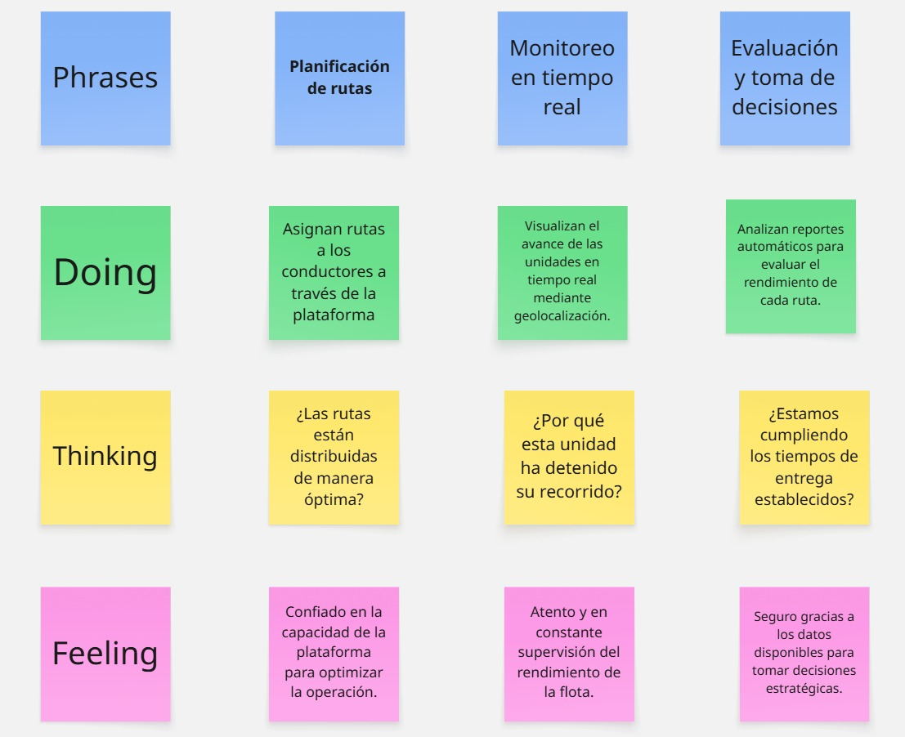
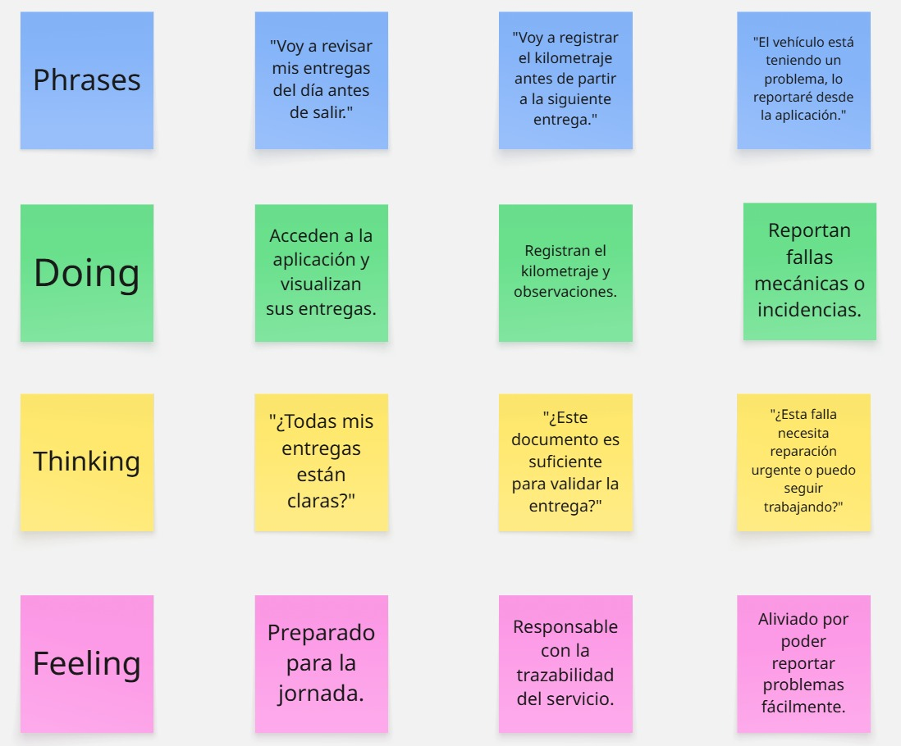

## 3.1 To-Be Scenario Mapping
### Segmento 1: Gestores de Flota

### Segmento 2: Conductores de Transporte

## 3.2 User Stories
### Epics

| Epics ID | Título                           | Descripción                                                                                     |
|----------|----------------------------------|-------------------------------------------------------------------------------------------------|
| EP01     | Gestión de flota                | Como gestor quiero tener control total de las unidades de transporte, rutas y mantenimientos. |
| EP02     | Gestión de entregas             | Como conductor quiero registrar y visualizar mis entregas para tener claridad en mis tareas.  |
| EP03     | Gestión de incidencias          | Como conductor o gestor quiero reportar y visualizar incidencias para actuar rápidamente.     |
| EP04     | Gestión de mantenimiento        | Como gestor quiero planificar y llevar control de los mantenimientos de cada vehículo.         |
| EP05     | Gestión de indicadores          | Como gestor quiero ver reportes e indicadores automáticos para evaluar el desempeño diario.    |
| EP-LP    | Sitio web estático              | Como visitante quiero conocer los servicios y características de la plataforma para decidir si contratar.|
| EP-API   | API RESTful                     | Como desarrollador quiero acceder a los servicios mediante endpoints para integrarlos con otras aplicaciones. |
### User Stories 
 <table>
    <thead>
        <tr>
            <th>Epic/Story ID</th>
            <th>Título</th>
            <th>Descripción</th>
            <th>Criterios de Aceptación</th>
            <th>Relacionada con (Epic ID)</th>
        </tr>
    </thead>
    <tbody>
        <tr>
            <td>US-01</td>
            <td>Consultar rutas asignadas</td>
            <td>Como gestor, quiero conocer las rutas asignadas a cada unidad para supervisar su cumplimiento operativo.</td>
            <td>
                Escenario 01: Consulta de rutas 
                Dado que el gestor accede al módulo de unidades 
                Cuando consulta una unidad específica 
                Entonces el sistema proporciona la información de ruta, horarios y destinos.
            </td>
            <td>EP01</td>
        </tr>
        <tr>
            <td>US-02</td>
            <td>Asignar unidades a rutas</td>
            <td>Como gestor, quiero asignar unidades de transporte a rutas específicas para controlar la operación.</td>
            <td>
                Escenario 01: Asignación de unidad 
                Dado que el gestor accede a la sección de asignaciones 
                Cuando selecciona una ruta y una unidad disponible 
                Entonces el sistema registra la asignación correctamente.
            </td>
            <td>EP01</td>
        </tr>
        <tr>
            <td>US-03</td>
            <td>Actualizar estado de unidad</td>
            <td>Como gestor, quiero marcar una unidad como disponible o en mantenimiento para una mejor gestión.</td>
            <td>
                Escenario 01: Actualización de estado 
                Dado que el gestor selecciona una unidad 
                Cuando modifica su estado a disponible o en mantenimiento 
                Entonces el sistema refleja correctamente el nuevo estado.
            </td>
            <td>EP01</td>
        </tr>
        <tr>
            <td>US-04</td>
            <td>Consultar historial de movimientos</td>
            <td>Como gestor, quiero revisar el historial de movimientos de una unidad para rastrear su actividad.</td>
            <td>
                Escenario 01: Revisión de historial 
                Dado que el gestor accede al detalle de una unidad 
                Cuando consulta el historial de movimientos 
                Entonces el sistema entrega una lista con fechas y tipos de movimiento.
            </td>
            <td>EP01</td>
        </tr>
        <tr>
            <td>US-05</td>
            <td>Consultar entregas asignadas</td>
            <td>Como conductor, quiero conocer las entregas asignadas del día para planificar mi jornada.</td>
            <td>
                Escenario 01: Revisión de entregas 
                Dado que el conductor ha iniciado sesión 
                Cuando accede a su información de entregas 
                Entonces el sistema presenta las entregas con datos de hora, cliente y dirección.
            </td>
            <td>EP02</td>
        </tr>
        <tr>
            <td>US-06</td>
            <td>Registrar evidencia de entrega</td>
            <td>Como conductor, quiero dejar constancia de entregas realizadas mediante evidencia para validarlas.</td>
            <td>
                Escenario 01: Registro de entrega 
                Dado que se finaliza una entrega 
                Cuando se adjunta la información de evidencia 
                Entonces el sistema almacena los datos con fecha, hora y ubicación.
            </td>
            <td>EP02</td>
        </tr>
        <tr>
            <td>US-07</td>
            <td>Revisar entregas completadas</td>
            <td>Como conductor, quiero consultar mis entregas pasadas para llevar control de mis actividades.</td>
            <td>
                Escenario 01: Consulta de historial 
                Dado que el conductor accede al módulo de entregas 
                Cuando filtra por fecha 
                Entonces el sistema muestra la información correspondiente.
            </td>
            <td>EP02</td>
        </tr>
        <tr>
            <td>US-08</td>
            <td>Registrar inicio de ruta</td>
            <td>Como conductor, quiero confirmar el inicio de mi ruta para registrar la hora de salida.</td>
            <td>
                Escenario 01: Registro de inicio 
                Dado que el conductor cuenta con entregas asignadas 
                Cuando inicia su jornada 
                Entonces el sistema registra la hora de salida.
            </td>
            <td>EP02</td>
        </tr>
        <tr>
            <td>US-09</td>
            <td>Reportar incidente</td>
            <td>Como conductor, quiero reportar incidentes durante la entrega para que el gestor pueda intervenir.</td>
            <td>
                Escenario 01: Registro de incidente 
                Dado que ocurre un problema en ruta 
                Cuando se reporta con evidencia 
                Entonces el sistema notifica al responsable correspondiente.
            </td>
            <td>EP03</td>
        </tr>
        <tr>
            <td>US-10</td>
            <td>Consultar incidencias</td>
            <td>Como gestor, quiero revisar las incidencias activas para tomar decisiones rápidas.</td>
            <td>
                Escenario 01: Revisión de incidencias 
                Dado que existen incidencias registradas 
                Cuando el gestor accede a la información 
                Entonces el sistema presenta datos como unidad, fecha y gravedad.
            </td>
            <td>EP03</td>
        </tr>
        <tr>
            <td>US-11</td>
            <td>Filtrar incidencias</td>
            <td>Como gestor, quiero filtrar las incidencias por gravedad para priorizar acciones.</td>
            <td>
                Escenario 01: Aplicación de filtros 
                Dado que hay múltiples incidencias 
                Cuando se selecciona un nivel de gravedad 
                Entonces el sistema presenta solo las que corresponden al filtro.
            </td>
            <td>EP03</td>
        </tr>
        <tr>
            <td>US-12</td>
            <td>Revisar historial de incidencias</td>
            <td>Como gestor, quiero analizar incidencias pasadas para tomar decisiones preventivas.</td>
            <td>
                Escenario 01: Consulta histórica 
                Dado que el gestor accede a registros anteriores 
                Cuando filtra por fechas 
                Entonces el sistema muestra detalles y estado de resolución.
            </td>
            <td>EP03</td>
        </tr>
        <tr>
            <td>US-13</td>
            <td>Programar mantenimiento</td>
            <td>Como gestor, quiero definir mantenimientos periódicos para evitar fallos imprevistos.</td>
            <td>
                Escenario 01: Planificación 
                Dado que el gestor selecciona una unidad 
                Cuando define la frecuencia de mantenimiento 
                Entonces el sistema agenda las fechas correspondientes.
            </td>
            <td>EP04</td>
        </tr>
        <tr>
            <td>US-14</td>
            <td>Registrar mantenimiento</td>
            <td>Como técnico, quiero documentar el mantenimiento realizado para dejar constancia.</td>
            <td>
                Escenario 01: Registro 
                Dado que el mantenimiento fue realizado 
                Cuando se documentan las acciones realizadas 
                Entonces el sistema almacena el informe en el historial.
            </td>
            <td>EP04</td>
        </tr>
        <tr>
            <td>US-15</td>
            <td>Consultar mantenimientos próximos</td>
            <td>Como gestor, quiero conocer las próximas fechas de mantenimiento para planificar con anticipación.</td>
            <td>
                Escenario 01: Consulta de agenda 
                Dado que hay mantenimientos programados 
                Cuando se accede al calendario 
                Entonces el sistema muestra las fechas por unidad.
            </td>
            <td>EP04</td>
        </tr>
        <tr>
            <td>US-16</td>
            <td>Recibir alertas de mantenimiento</td>
            <td>Como gestor, quiero recibir alertas de mantenimiento próximo para evitar retrasos.</td>
            <td>
                Escenario 01: Generación de alertas 
                Dado que se acerca una fecha de mantenimiento 
                Cuando faltan 3 días 
                Entonces el sistema envía una alerta automática.
            </td>
            <td>EP04</td>
        </tr>
        <tr>
            <td>US-17</td>
            <td>Generar reporte semanal</td>
            <td>Como gestor, quiero ver reportes semanales de entregas para evaluar el rendimiento del personal.</td>
            <td>
                Escenario 01: Visualización de reporte 
                Dado que ha concluido la semana 
                Cuando se accede al módulo de reportes 
                Entonces el sistema presenta estadísticas de cumplimiento por conductor.
            </td>
            <td>EP05</td>
        </tr>
        <tr>
            <td>US-18</td>
            <td>Evaluar eficiencia por unidad</td>
            <td>Como gestor, quiero conocer el rendimiento por unidad para tomar decisiones de uso.</td>
            <td>
                Escenario 01: Evaluación de rendimiento 
                Dado que hay datos de entregas y kilometraje 
                Cuando se accede al análisis 
                Entonces el sistema presenta eficiencia por unidad.
            </td>
            <td>EP05</td>
        </tr>
        <tr>
            <td>US-19</td>
            <td>Comparar desempeño entre conductores</td>
            <td>Como gestor, quiero comparar a los conductores para fomentar mejores prácticas.</td>
            <td>
                Escenario 01: Comparación de desempeño 
                Dado que existen registros suficientes 
                Cuando se selecciona un periodo 
                Entonces el sistema genera un ranking con métricas relevantes.
            </td>
            <td>EP05</td>
        </tr>
        <tr>
            <td>US-20</td>
            <td>Monitorear alertas críticas</td>
            <td>Como gestor, quiero visualizar alertas críticas del sistema para tomar acciones inmediatas.</td>
            <td>
                Escenario 01: Visualización de alertas 
                Dado que existen alertas activas 
                Cuando se accede al panel principal 
                Entonces el sistema muestra las de mayor prioridad destacadas.
            </td>
            <td>EP05</td>
        </tr>
                <tr>
            <td>US-21</td>
            <td>Consultar información de servicios</td>
            <td>Como visitante, quiero conocer los servicios disponibles para evaluar si se adecuan a mis necesidades.</td>
            <td>
                Escenario 01: Acceso a información 
                Dado que el visitante accede al sitio web 
                Cuando recorre la sección informativa 
                Entonces el sistema presenta descripciones claras de los servicios.  
                Escenario 02: Consulta de características 
                Dado que se requiere mayor detalle 
                Cuando se solicita información específica 
                Entonces el sistema entrega las características correspondientes.
            </td>
            <td>EP-LP</td>
        </tr>
        <tr>
            <td>US-22</td>
            <td>Solicitar demostración</td>
            <td>Como visitante, quiero registrar interés en una demostración para conocer mejor el sistema.</td>
            <td>
                Escenario 01: Registro exitoso 
                Dado que se ingresan datos válidos 
                Cuando se envía la solicitud 
                Entonces el sistema confirma la recepción y describe el siguiente paso.  
                Escenario 02: Registro inválido 
                Dado que se ingresan datos incompletos 
                Cuando se procesa la solicitud 
                Entonces el sistema informa los errores identificados.
            </td>
            <td>EP-LP</td>
        </tr>
        <tr>
            <td>US-23</td>
            <td>Consultar planes y precios</td>
            <td>Como visitante, quiero comparar los planes disponibles para elegir el que mejor se adapta.</td>
            <td>
                Escenario 01: Comparación de planes 
                Dado que se accede a la sección de precios 
                Cuando se consulta la información 
                Entonces el sistema presenta detalles y precios de cada plan.  
                Escenario 02: Elección de plan 
                Dado que se elige un plan 
                Cuando se solicita continuar 
                Entonces el sistema redirige a la sección correspondiente con el plan predefinido.
            </td>
            <td>EP-LP</td>
        </tr>
        <tr>
            <td>US-24</td>
            <td>Solicitar asistencia</td>
            <td>Como visitante, quiero contactar con el soporte para resolver dudas sobre el servicio.</td>
            <td>
                Escenario 01: Envío de consulta 
                Dado que se redacta un mensaje de contacto 
                Cuando se envía la solicitud 
                Entonces el sistema registra la consulta y comunica un tiempo estimado de respuesta.  
                Escenario 02: Acceso a preguntas frecuentes 
                Dado que se buscan respuestas previas 
                Cuando se accede a la sección informativa 
                Entonces el sistema presenta las preguntas frecuentes disponibles.
            </td>
            <td>EP-LP</td>
        </tr>
        <tr>
            <td>US-25</td>
            <td>Consultar casos de éxito</td>
            <td>Como visitante, quiero revisar casos de éxito para conocer experiencias reales con el sistema.</td>
            <td>
                Escenario 01: Revisión de testimonios 
                Dado que se accede a la sección de experiencias 
                Cuando se selecciona un caso 
                Entonces el sistema presenta el contenido completo con resultados.  
                Escenario 02: Filtrado de casos 
                Dado que se requiere una vista segmentada 
                Cuando se filtra por industria 
                Entonces el sistema muestra solo los casos relacionados.
            </td>
            <td>EP-LP</td>
        </tr>
        <tr>
            <td>TS-01</td>
            <td>Autenticación API</td>
            <td>Como desarrollador, quiero implementar autenticación mediante JWT para proteger el acceso a la API.</td>
            <td>
                Escenario 01: Autenticación válida 
                Dado que se envían credenciales correctas 
                Cuando la API las procesa 
                Entonces retorna un token JWT y código 200.  
                Escenario 02: Autenticación fallida 
                Dado que las credenciales son incorrectas 
                Cuando se procesa la solicitud 
                Entonces se retorna error con código 401.  
                Escenario 03: Token expirado 
                Dado que se utiliza un token vencido 
                Cuando se realiza una solicitud 
                Entonces el sistema retorna error 401 por expiración.
            </td>
            <td>EP-API</td>
        </tr>
        <tr>
            <td>TS-02</td>
            <td>Gestión de unidades vía API</td>
            <td>Como desarrollador, quiero usar endpoints CRUD para gestionar unidades desde aplicaciones externas.</td>
            <td>
                Escenario 01: Consulta de unidades 
                Dado que se realiza una solicitud GET autorizada 
                Cuando se consulta /api/units 
                Entonces la API retorna la lista de unidades.  
                Escenario 02: Registro de unidad 
                Dado que se proporciona información válida 
                Cuando se envía una solicitud POST 
                Entonces la API registra la unidad y retorna código 201.  
                Escenario 03: Datos inválidos 
                Dado que la solicitud contiene errores 
                Cuando la API valida los datos 
                Entonces retorna error con código 400.
            </td>
            <td>EP-API</td>
        </tr>
        <tr>
            <td>TS-03</td>
            <td>Gestión de entregas vía API</td>
            <td>Como desarrollador, quiero usar endpoints para registrar y consultar entregas desde apps móviles.</td>
            <td>
                Escenario 01: Registro de entrega 
                Dado que se proporciona información válida 
                Cuando se envía una solicitud POST 
                Entonces la API guarda la entrega y retorna su ID.  
                Escenario 02: Consulta de entregas 
                Dado que se desea consultar entregas por conductor 
                Cuando se usa un filtro adecuado 
                Entonces la API retorna los resultados correspondientes.  
                Escenario 03: Actualización de estado 
                Dado que se requiere cambiar el estado de una entrega 
                Cuando se envía una solicitud PATCH 
                Entonces el estado se actualiza correctamente.
            </td>
            <td>EP-API</td>
        </tr>
        <tr>
            <td>TS-04</td>
            <td>Gestión de incidencias vía API</td>
            <td>Como desarrollador, quiero implementar endpoints para reportar y resolver incidencias del sistema.</td>
            <td>
                Escenario 01: Reporte de incidencia 
                Dado que se ingresa información válida 
                Cuando se envía a /api/incidents 
                Entonces la API registra el incidente y notifica.  
                Escenario 02: Consulta de incidencias activas 
                Dado que se requiere información filtrada 
                Cuando se usa active=true 
                Entonces la API devuelve solo las incidencias pendientes.  
                Escenario 03: Cierre de incidencia 
                Dado que se resuelve un incidente 
                Cuando se actualiza su estado 
                Entonces la API marca como resuelta y notifica al interesado.
            </td>
            <td>EP-API</td>
        </tr>
        <tr>
            <td>TS-05</td>
            <td>Consulta de estadísticas vía API</td>
            <td>Como desarrollador, quiero acceder a estadísticas desde la API para integrarlas en reportes externos.</td>
            <td>
                Escenario 01: Consulta de métricas 
                Dado que se realiza una solicitud GET con filtros 
                Cuando la API procesa los parámetros 
                Entonces retorna los datos agregados.  
                Escenario 02: Exportación de reportes 
                Dado que se solicita un reporte 
                Cuando se indica el formato (CSV, PDF) 
                Entonces la API entrega el archivo correspondiente.  
                Escenario 03: Consulta en tiempo real 
                Dado que se requiere información actualizada 
                Cuando se consulta el endpoint de tiempo real 
                Entonces la API entrega datos en vivo.
            </td>
            <td>EP-API</td>
        </tr>
    </tbody>
</table>

### Gestor de flota

### Conductores de transporte

## 3.4 Product Backlog

<table>
    <thead>
        <tr>
            <th># Orden</th>
            <th>User Story ID</th>
            <th>Título</th>
            <th>Descripción</th>
            <th>Story Points (1/2/3/5/8)</th>
        </tr>
    </thead>
    <tbody>
        <tr>
            <td>1</td>
            <td>US-05</td>
            <td>Consultar entregas pendientes</td>
            <td>Como conductor, quiero ver las entregas asignadas del día, para planificar mi ruta.</td>
            <td>8</td>
        </tr>
        <tr>
            <td>2</td>
            <td>US-01</td>
            <td>Visualizar rutas asignadas</td>
            <td>Como gestor, quiero ver las rutas asignadas a cada unidad, para hacer seguimiento efectivo.</td>
            <td>8</td>
        </tr>
        <tr>
            <td>3</td>
            <td>US-09</td>
            <td>Reportar incidente durante entrega</td>
            <td>Como conductor, quiero reportar un incidente, para alertar al gestor y agilizar la solución.</td>
            <td>8</td>
        </tr>
        <tr>
            <td>4</td>
            <td>US-13</td>
            <td>Programar mantenimiento preventivo</td>
            <td>Como gestor, quiero programar mantenimientos regulares, para evitar fallas inesperadas.</td>
            <td>8</td>
        </tr>
        <tr>
            <td>5</td>
            <td>US-17</td>
            <td>Ver reporte semanal de entregas</td>
            <td>Como gestor, quiero ver un reporte semanal por conductor, para evaluar su rendimiento.</td>
            <td>5</td>
        </tr>
        <tr>
            <td>6</td>
            <td>US-03</td>
            <td>Registrar disponibilidad de unidad</td>
            <td>Como gestor, quiero marcar una unidad como disponible o en mantenimiento, para gestionar eficientemente.</td>
            <td>5</td>
        </tr>
        <tr>
            <td>7</td>
            <td>US-08</td>
            <td>Confirmar inicio de ruta</td>
            <td>Como conductor, quiero confirmar el inicio de mi ruta, para registrar la hora de salida.</td>
            <td>5</td>
        </tr>
        <tr>
            <td>8</td>
            <td>US-12</td>
            <td>Visualizar historial de incidencias</td>
            <td>Como gestor, quiero revisar el historial de incidencias pasadas, para tomar decisiones preventivas.</td>
            <td>5</td>
        </tr>
        <tr>
            <td>9</td>
            <td>US-04</td>
            <td>Visualizar historial de movimientos</td>
            <td>Como gestor, quiero ver el historial de movimientos de una unidad, para rastrear sus actividades.</td>
            <td>5</td>
        </tr>
        <tr>
            <td>10</td>
            <td>US-16</td>
            <td>Notificación de mantenimiento pendiente</td>
            <td>Como gestor, quiero recibir alertas de mantenimiento próximo, para actuar con anticipación.</td>
            <td>5</td>
        </tr>
        <tr>
            <td>11</td>
            <td>US-07</td>
            <td>Visualizar entregas completadas</td>
            <td>Como conductor, quiero ver un historial de entregas completadas, para llevar control de mis actividades.</td>
            <td>5</td>
        </tr>
        <tr>
            <td>12</td>
            <td>US-10</td>
            <td>Visualizar estado de incidencias</td>
            <td>Como gestor, quiero ver un listado de incidencias activas, para tomar acción rápidamente.</td>
            <td>5</td>
        </tr>
        <tr>
            <td>13</td>
            <td>US-14</td>
            <td>Registrar mantenimiento realizado</td>
            <td>Como técnico, quiero registrar el mantenimiento con detalles, para dejar constancia de lo realizado.</td>
            <td>3</td>
        </tr>
        <tr>
            <td>14</td>
            <td>US-19</td>
            <td>Comparar rendimiento entre conductores</td>
            <td>Como gestor, quiero comparar eficiencia entre conductores, para fomentar buenas prácticas.</td>
            <td>3</td>
        </tr>
        <tr>
            <td>15</td>
            <td>US-06</td>
            <td>Registrar entrega con evidencia</td>
            <td>Como conductor, quiero registrar entregas con foto y firma, para validar su cumplimiento.</td>
            <td>3</td>
        </tr>
        <tr>
            <td>16</td>
            <td>US-11</td>
            <td>Filtrar incidencias por gravedad</td>
            <td>Como gestor, quiero filtrar las incidencias según su gravedad, para priorizar las más urgentes.</td>
            <td>3</td>
        </tr>
        <tr>
            <td>17</td>
            <td>US-02</td>
            <td>Asignar unidades a rutas</td>
            <td>Como gestor, quiero asignar unidades de transporte a rutas específicas, para controlar la operación.</td>
            <td>2</td>
        </tr>
        <tr>
            <td>18</td>
            <td>US-18</td>
            <td>Ver eficiencia por unidad</td>
            <td>Como gestor, quiero ver rendimiento por unidad, para tomar decisiones sobre el uso de la flota.</td>
            <td>2</td>
        </tr>
        <tr>
            <td>19</td>
            <td>US-15</td>
            <td>Ver próximas fechas de mantenimiento</td>
            <td>Como gestor, quiero ver en un calendario las fechas de mantenimiento, para no olvidar los programados.</td>
            <td>2</td>
        </tr>
        <tr>
            <td>20</td>
            <td>US-20</td>
            <td>Visualizar alertas críticas en dashboard</td>
            <td>Como gestor, quiero ver alertas prioritarias en el dashboard, para atender eventos críticos de inmediato.</td>
            <td>1</td>
        </tr>
        <tr>
            <td>21</td>
            <td>US-21</td>
            <td>Visualizar información de servicio</td>
            <td>Como visitante, quiero conocer los servicios de gestión de flotas ofrecidos, para evaluar si satisface mis necesidades.</td>
            <td>3</td>
        </tr>
        <tr>
            <td>22</td>
            <td>US-22</td>
            <td>Registrar solicitud de demo</td>
            <td>Como visitante, quiero solicitar una demostración del sistema, para conocer la plataforma antes de contratar.</td>
            <td>5</td>
        </tr>
        <tr>
            <td>23</td>
            <td>US-23</td>
            <td>Visualizar planes y precios</td>
            <td>Como visitante, quiero conocer los diferentes planes disponibles y sus precios, para seleccionar el más adecuado a mis necesidades.</td>
            <td>3</td>
        </tr>
        <tr>
            <td>24</td>
            <td>US-24</td>
            <td>Contactar con soporte</td>
            <td>Como visitante, quiero contactar con el equipo de soporte, para resolver dudas sobre el servicio.</td>
            <td>2</td>
        </tr>
        <tr>
            <td>25</td>
            <td>US-25</td>
            <td>Visualizar casos de éxito</td>
            <td>Como visitante, quiero ver testimonios y casos de éxito, para evaluar la efectividad del sistema en casos reales.</td>
            <td>5</td>
        </tr>
        <tr>
            <td>26</td>
            <td>TS-01</td>
            <td>Autenticación API</td>
            <td>Como desarrollador, quiero implementar un sistema de autenticación JWT, para asegurar el acceso a los endpoints de la API.</td>
            <td>8</td>
        </tr>
        <tr>
            <td>27</td>
            <td>TS-02</td>
            <td>Endpoints de unidades</td>
            <td>Como desarrollador, quiero implementar endpoints CRUD para unidades de transporte, para gestionar la flota desde aplicaciones externas.</td>
            <td>5</td>
        </tr>
        <tr>
            <td>28</td>
            <td>TS-03</td>
            <td>Endpoints de entregas</td>
            <td>Como desarrollador, quiero implementar endpoints para gestionar entregas, para permitir su registro y consulta desde aplicaciones móviles.</td>
            <td>5</td>
        </tr>
        <tr>
            <td>29</td>
            <td>TS-04</td>
            <td>Endpoints de incidencias</td>
            <td>Como desarrollador, quiero implementar endpoints para gestionar incidencias, para facilitar su reporte desde diversas plataformas.</td>
            <td>5</td>
        </tr>
        <tr>
            <td>30</td>
            <td>TS-05</td>
            <td>Endpoints de estadísticas</td>
            <td>Como desarrollador, quiero implementar endpoints para obtener métricas y estadísticas, para facilitar la visualización de reportes.</td>
            <td>8</td>
        </tr>
    </tbody>
</table>
