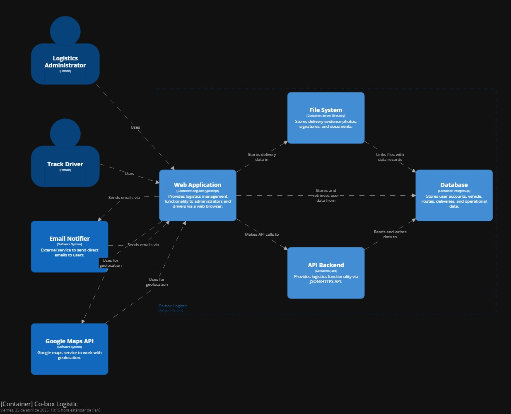

## Capítulo IV: Product Design 

### 4.1. Style Guidelines
 A continuación, se especificará los parámetros implementados en la estructura del proyecto.
#### 4.1.1. General Style Guidelines
**Brand Overview**

La startup “Co-Box Logistics”, se enfoca en ofrecer una solución tecnológica avanzada al sector del transporte de carga en Perú. Para ello, implementa una plataforma web inteligente encargada de segmentar y optimizar los procesos logísticos en distintas fases. Estas comprenden el control de kilometraje de las unidades, la captura de evidencias fotográficas al momento de la entrega, la geolocalización en tiempo real y la generación automatizada de reportes e indicadores de desempeño.

**Brand Name**

El nombre de la propuesta de solución es Co-Box Logistics. La idea surge de la combinación de las palabras “Asistencia, Funcionalidad y Eficiencia”, elementos clave que definen el enfoque de la plataforma. Este concepto está directamente relacionado con el problema que busca resolver: la falta de control, trazabilidad y eficiencia en el sector del transporte de carga. En ese sentido, la aplicación se orienta al desarrollo de un sistema web inteligente que automatiza y optimiza la gestión de servicios logísticos en empresas de transporte, mejorando cada fase del proceso mediante el uso de tecnologías avanzadas como la geolocalización, el registro de kilometraje y la generación automática de reportes.

**Logo:** 

**Typography**

La tipografía es necesaria para estructurar y organizar el lenguaje visual de todas las plataformas que se desarrollarán para cumplir con las características principales de la aplicación. Se ha tomado en cuenta que las fuentes deben ser legibles y deben aportar a la experiencia del usuario, por ello se optó por estos tipos de letra.

**Head**

**Body**

**Colors**

**Spacing**

**Tono de Comunicación y lenguaje aplicado**

Color primario: Este color representa la identidad visual de los operadores logísticos y técnicos de campo. A través de él, buscamos transmitir confianza, eficiencia y profesionalismo. Al interactuar con la plataforma, el usuario percibirá este tono como cercano y confiable, lo que se reflejará también en el contacto con los encargados de las entregas y supervisiones.
Color secundario: Despierta una sensación de movimiento y acción. Es un color que inspira energía, dinamismo y compromiso con el trabajo bien hecho. Este tono refuerza la visión de Co-Box Logistics como una solución que conecta tecnología y eficiencia para transformar el transporte de carga. 
Blanco: Refleja orden, simplicidad y transparencia. Es un color ampliamente utilizado en entornos tecnológicos y de gestión, pues facilita la legibilidad y aporta claridad a la interfaz de usuario.
Negro: Transmite seriedad, modernidad y autoridad. Sirve como contraste para resaltar funciones clave y elementos importantes de la plataforma.
En cuanto al lenguaje, se optará por un tono profesional, directo y respetuoso, acompañado de un enfoque entusiasta y resolutivo. Co-Box Logistics incluirá mensajes, recomendaciones y experiencias que motiven al usuario a tomar decisiones informadas, reforzando la confiabilidad del sistema. 

#### 4.1.2. Web Style Guidelines
Desarrollaremos una aplicación que se adecue a cualquier dispositivo tecnológico sin la necesidad de malograr el diseño del contenido. Por ello, se tendrá que tomar en cuenta cada tipo de dispositivo para que el contenido esté estructurado de la mejor manera para cada uno.

**Patrón Z**

Se implementará el patrón Z, el punto de partida se sitúa en la esquina superior izquierda, donde estará visible nuestro logotipo, sirviendo como referencia inicial. Desde allí, la vista se dirige hacia la esquina superior derecha, zona en la que se ubicarán los accesos principales como “Sobre Nosotros”, “Reservas” y “Configuración”.

**Botones**

**Elementos Grandes**

**Tarjetas**

Link para visualizar el figma con el Style Guidelines general:https://www.figma.com/design/wcyVOlGQfIERlEbFh3Ly2S/Style-Guidelines?node-id=1-2&t=rV25Yk6baCQtLWrD-1

### 4.2. Information Architecture
En esta sección, definiremos la estructuración de nuestro producto para cada uno de nuestros segmentos objetivo. Abarcaremos diversos componentes que permitirán al usuario a organizar y encontrar su contenido: Organization systems, Labeling systems, SEO Tags and Meta Tags, Searching systems y Navigation systems.

#### 4.2.1. Organization Systems
En esta sección, se detalla cómo la plataforma Co-Box Logistics estructura la información y funcionalidades clave, considerando las necesidades específicas de sus segmentos objetivo. Co-Box Logistics conecta a empresas de transporte con herramientas inteligentes que permiten un control preciso y automatizado de cada servicio, incluyendo kilometraje, geolocalización y evidencia fotográfica, facilitando una gestión logística más eficiente y moderna.

**Segmento 1: Gerentes / Encargados de flota**
**Jerárquica:**

- Panel de control de flota: Resume el estado actual de cada unidad. Organizado según prioridad operativa: unidades con alertas de mantenimiento, bajo rendimiento o uso excesivo de combustible aparecen primero.

- Historial de rutas y servicios: Registro cronológico de viajes completados con acceso a evidencias, kilometraje y ubicación. Permite evaluar la eficiencia por fechas o rutas específicas.

- Ficha técnica de unidades: Información detallada por vehículo, como placa, odómetro, consumo, alertas técnicas y próximas revisiones.

- Indicadores y reportes de desempeño: Métricas clave categorizadas por vehículo, conductor o ruta, con filtros personalizables para analizar eficiencia operativa.

**Secuencial:**
 - Programación de servicios: Flujo guiado paso a paso para asignar rutas y conductores. Se incluyen fases de planificación, validación de disponibilidad y confirmación de servicio.

 - Emisión de reportes automatizados: Tras cada servicio, se genera un reporte con kilometraje, ubicación, incidencias y rendimiento del conductor, en una estructura clara y secuencial.

 **Segmento 2: Conductores / Operadores de ruta**
**Jerárquica:**
 - Historial de viajes realizados: Lista de viajes anteriores categorizada cronológicamente, accesible desde el panel principal.
 - Resumen diario de tareas: Muestra rutas asignadas con filtros por estado (pendiente, en curso, finalizado).
 - Perfil del conductor: Sección con datos personales, métricas de desempeño y cumplimiento de reportes, organizado por relevancia.

**Secuencial:**
 - Inicio de servicio: Flujo intuitivo:
   - Paso 1: “Iniciar viaje”.
   - Paso 2: Captura de foto del odómetro.
   - Paso 3: Registro de paradas vía geolocalización.
   - Paso 4: “Finalizar viaje” con carga automática de datos al sistema.
 - Registro de combustible: Formulario simple con captura fotográfica del ticket, litros cargados y comentario opcional.

#### 4.2.2. Labeling Systems
El sistema de etiquetado de  Co-Box Logistics ha sido diseñado para facilitar la navegación rápida, clara y accesible, optimizando la experiencia de cada tipo de usuario.
**Web App - Gerentes/Encargados de flota**

**Menú lateral con etiquetas funcionales y directas:**
 - Inicio: Vista general de la operación diaria (servicios activos, alertas, resumen de desempeño).
 - Rutas asignadas: Gestión y control de entregas en curso y próximas.
 - Unidades: Información técnica y estado de cada vehículo.
 - Reportes: Acceso a KPIs e informes personalizables.
 - Configuración: Ajustes del sistema, alertas automáticas y permisos.

**App Móvil - Conductores/Operadores de ruta**

**Menú principal con botones de acción y navegación sencilla, pensada para el entorno móvil en ruta:**
 - Iniciar viaje: Comienza el servicio con geolocalización activa.
 - Foto odómetro: Captura rápida del estado inicial del vehículo.
 - Finalizar viaje: Cierra el servicio e ingresa observaciones.
 - Mi historial: Consulta de viajes previos y métricas.
 - Perfil: Datos personales y desempeño.
 - Soporte: Acceso rápido a ayuda y contacto.

#### 4.2.3. SEO Tags and Meta Tags

<h4>Landing Page</h4>

<strong>Title:</strong> 
Co-Box Logistics | Plataforma Inteligente para Gestión de Transporte de Carga

<strong>Meta Description:</strong> 
Descubre Co-Box Logistics, la solución digital avanzada para empresas de transporte en Perú. Optimiza rutas, controla kilometraje, captura evidencias y mejora la trazabilidad logística en una sola plataforma.

<strong>Meta Keywords:</strong> 
logística, transporte de carga, gestión de flotas, kilometraje, geolocalización, reportes automáticos, Co-Box Logistics, control de vehículos, logística Perú

<strong>Meta Author:</strong> 
Equipo de Desarrollo - Co-Box Logistics

<h4>Aplicación Web</h4>

<strong>Title:</strong> 
Panel de Control | Co-Box Logistics - Gestión de Flotas y Rutas en Tiempo Real

<strong>Meta Description:</strong> 
Accede al panel de gestión de Co-Box Logistics y administra rutas, conductores, mantenimientos y reportes en tiempo real. Plataforma web eficiente para optimizar la logística de transporte.

<strong>Meta Keywords:</strong> 
panel de control, gestión logística, rutas, conductores, transporte inteligente, reportes automáticos, odómetro, eficiencia logística

<strong>Meta Author:</strong> 
Equipo Técnico - Co-Box Logistics

#### 4.2.4. Searching Systems

**Opciones de Búsqueda**  
**Barra de Búsqueda**

**Categorías**

**Etiquetas Populares**  

**Filtros Disponibles**  

**Apariencia de los Datos Después de la Búsqueda**  
**Listados de Resultados**  

**Resumen y Descripción**  

**Opciones de Ordenación y Filtros Aplicados**  

**Revisiones y Comentarios**  

#### 4.2.5. Navigation Systems

1. **Páginas Principales**

2. **Opciones de Usuario**

3. **Búsqueda y Navegación**

4. **Branding y Identidad**

### 4.3. Landing Page UI Design
#### 4.3.1. Landing Page Wireframe

#### 4.3.2. Landing Page Mockup

## 4.4. Web Applications UX/UI Design

#### 4.4.1. Web Applications Wireframes

#### 4.4.2. Web Applications Wireflow Diagrams

#### 4.4.3. Web Applications Mock-ups

#### 4.4.4. Web Applications User Flow Diagrams

### 4.5. Web Applications Prototyping

### 4.6 Domain Driven Software Architecture
En esta sección se presenta la arquitectura de software basada en el dominio para Cobox-Logistic. Se detallan los diferentes diagramas que ilustran la estructura y organización del sistema, así como los componentes clave que lo integran, mostrando cómo se interconectan para proporcionar una solución eficiente y escalable.

#### 4.6.1. Software Architecture Context Diagram

#### 4.6.2. Software Architecture Container Diagrams

#### 4.6.3. Software Architecture Components Diagrams

### 4.7. Software Object-Oriented Design
En esta sección se presenta el diseño de software orientado a objetos para OsitoPolar. Se incluyen diagramas de clases y un diccionario de clases que detallan la estructura y los atributos de las principales entidades del sistema, ofreciendo una visión clara de cómo se organizan y gestionan los componentes clave dentro de la plataforma.

#### 4.7.1. Class Diagrams

Link para visualizar en LucidChart: https://lucid.app/lucidchart/3ec59595-e197-4aa8-b849-5a46563d7d3c/edit?viewport_loc=-4168%2C-3667%2C7703%2C3581%2C0_0&invitationId=inv_71acbb3d-962c-4709-a359-8c619cb6d81a

#### 4.7.2. Class Dictionary

<h3>Usuario</h3>

<strong>Descripción:</strong> Clase base que representa a cualquier usuario del sistema.

<strong>Atributos:</strong>

<ul>
  <li><code>id</code>: Identificador único del usuario</li>
  <li><code>nombre</code>, <code>apellido</code>, <code>email</code>, <code>telefono</code></li>
  <li><code>password</code>: Contraseña encriptada</li>
  <li><code>tipo</code>: Tipo de usuario (Gestor, Conductor, Técnico)</li>
  <li><code>fechaCreacion</code>, <code>activo</code></li>
</ul>

<strong>Métodos:</strong>

<ul>
  <li><code>autenticar()</code>: Verifica credenciales</li>
  <li><code>actualizarPerfil()</code>: Actualiza información personal</li>
</ul>

<h3>Gestor</h3>

<strong>Descripción:</strong> Usuario que administra la flota.

<ul>
  <li><strong>Atributo:</strong> <code>cargo</code></li>
  <li><strong>Métodos:</strong> <code>asignarRuta()</code>, <code>generarReporte()</code>, <code>visualizarDashboard()</code></li>
</ul>

<h3>Conductor</h3>

<strong>Descripción:</strong> Usuario que ejecuta rutas y registra entregas.

<ul>
  <li><strong>Atributos:</strong> <code>licencia</code>, <code>categoria</code>, <code>fechaVencimientoLicencia</code>, <code>disponible</code></li>
  <li><strong>Métodos:</strong> <code>iniciarRuta()</code>, <code>finalizarRuta()</code>, <code>reportarIncidencia()</code>, <code>registrarEntrega()</code></li>
</ul>

<h3>Técnico</h3>

<strong>Descripción:</strong> Encargado del mantenimiento de vehículos.

<ul>
  <li><strong>Atributo:</strong> <code>especialidad</code></li>
  <li><strong>Método:</strong> <code>registrarMantenimiento()</code></li>
</ul>

<h3>Vehículo</h3>

<strong>Descripción:</strong> Representa un vehículo de la flota.

<ul>
  <li><strong>Atributos:</strong> <code>id</code>, <code>placa</code>, <code>marca</code>, <code>modelo</code>, <code>anio</code>, <code>tipo</code>, <code>capacidadCarga</code>, <code>capacidadTanque</code>, <code>estado</code>, <code>kilometrajeActual</code>, <code>ultimoMantenimiento</code>, <code>activo</code></li>
  <li><strong>Métodos:</strong> <code>actualizarKilometraje()</code>, <code>cambiarEstado()</code></li>
</ul>

<h3>Ruta</h3>

<strong>Descripción:</strong> Trayecto planificado entre dos puntos.

<ul>
  <li><strong>Atributos:</strong> <code>id</code>, <code>origen</code>, <code>destino</code>, <code>distancia</code>, <code>fechaProgramada</code>, <code>estado</code>, <code>consumoEstimado</code></li>
  <li><strong>Métodos:</strong> <code>actualizarEstado()</code>, <code>calcularEficiencia()</code></li>
</ul>

<h3>Servicio</h3>

<strong>Descripción:</strong> Representa una operación logística completa.

<ul>
  <li><strong>Atributos:</strong> <code>id</code>, <code>fechaCreacion</code>, <code>fechaInicio</code>, <code>fechaFin</code>, <code>estado</code>, <code>observaciones</code></li>
  <li><strong>Métodos:</strong> <code>iniciarServicio()</code>, <code>finalizarServicio()</code>, <code>calcularDuracion()</code></li>
</ul>

<h3>Entrega</h3>

<strong>Descripción:</strong> Envío de mercancía a un cliente.

<ul>
  <li><strong>Atributos:</strong> <code>id</code>, <code>cliente</code>, <code>direccion</code>, <code>referencia</code>, <code>fechaProgramada</code>, <code>fechaEntrega</code>, <code>estado</code>, <code>observaciones</code>, <code>pesoTotal</code></li>
  <li><strong>Métodos:</strong> <code>actualizarEstado()</code>, <code>validarEntrega()</code></li>
</ul>

<h3>RegistroKilometraje</h3>

<strong>Descripción:</strong> Lectura del odómetro.

<ul>
  <li><strong>Atributos:</strong> <code>id</code>, <code>kilometrajeInicial</code>, <code>kilometrajeFinal</code>, <code>fecha</code></li>
  <li><strong>Método:</strong> <code>calcularDistancia()</code></li>
</ul>

<h3>RegistroCombustible</h3>

<strong>Descripción:</strong> Registro de cargas de combustible.

<ul>
  <li><strong>Atributos:</strong> <code>id</code>, <code>cantidad</code>, <code>precioUnitario</code>, <code>total</code>, <code>tipoCombustible</code>, <code>fecha</code>, <code>estacionServicio</code></li>
  <li><strong>Métodos:</strong> <code>validarRegistro()</code>, <code>calcularRendimiento()</code></li>
</ul>

<h3>Incidencia</h3>

<strong>Descripción:</strong> Reporte de problema o evento inesperado.

<ul>
  <li><strong>Atributos:</strong> <code>id</code>, <code>tipo</code>, <code>descripcion</code>, <code>fechaReporte</code>, <code>gravedad</code>, <code>estado</code></li>
  <li><strong>Métodos:</strong> <code>actualizarEstado()</code>, <code>asignarResponsable()</code></li>
</ul>

<h3>Mantenimiento</h3>

<strong>Descripción:</strong> Registro de acciones de mantenimiento.

<ul>
  <li><strong>Atributos:</strong> <code>id</code>, <code>tipo</code>, <code>fechaProgramada</code>, <code>fechaRealizada</code>, <code>descripcion</code>, <code>costo</code>, <code>estado</code></li>
  <li><strong>Métodos:</strong> <code>actualizarEstado()</code>, <code>notificarProximidad()</code></li>
</ul>

<h3>Evidencia</h3>

<strong>Descripción:</strong> Archivo que sirve como prueba de acción (foto, firma, etc.).

<ul>
  <li><strong>Atributos:</strong> <code>id</code>, <code>tipo</code>, <code>url</code>, <code>fecha</code>, <code>latitud</code>, <code>longitud</code></li>
  <li><strong>Método:</strong> <code>validarEvidencia()</code></li>
</ul>

<h3>Reporte</h3>

<strong>Descripción:</strong> Documento generado para análisis.

<ul>
  <li><strong>Atributos:</strong> <code>id</code>, <code>tipo</code>, <code>fechaInicio</code>, <code>fechaFin</code>, <code>formato</code></li>
  <li><strong>Métodos:</strong> <code>generarReporteEficiencia()</code>, <code>generarReporteEntregas()</code>, <code>exportarReporte()</code></li>
</ul>

<h3>Dashboard</h3>

<strong>Descripción:</strong> Panel con indicadores clave.

<ul>
  <li><strong>Atributo:</strong> <code>id</code></li>
  <li><strong>Métodos:</strong> <code>obtenerIndicadores()</code>, <code>obtenerAlertasCriticas()</code>, <code>actualizarDatos()</code></li>
</ul>

### 4.8. Database Design

<h2>Introducción</h2>

El sistema Co-box Logistic requiere una estructura de base de datos robusta y eficiente para gestionar las operaciones de transporte y logística. El diseño presentado a continuación permite almacenar y relacionar toda la información necesaria para cumplir con los requerimientos funcionales identificados en las fases previas del proyecto.

<h2>Modelo de Base de Datos</h2>

Se ha optado por un modelo de base de datos relacional que proporciona integridad referencial, consistencia de datos y facilita las consultas complejas necesarias para la generación de reportes e indicadores.

<h3>Características principales</h3>
<ul>
  <li><strong>Estructura normalizada:</strong> Diseño que sigue hasta la tercera forma normal para evitar redundancias.</li>
  <li><strong>Integridad referencial:</strong> Mantenida a través de claves foráneas y restricciones.</li>
  <li><strong>Optimización para consultas:</strong> Índices estratégicos en campos frecuentemente consultados.</li>
  <li><strong>Soporte para transacciones:</strong> Garantía de atomicidad en operaciones críticas.</li>
  <li><strong>Escalabilidad:</strong> Capacidad para crecer con el volumen de datos sin degradar el rendimiento.</li>
</ul>

<h2>Tablas Principales</h2>

<h3>Tabla: USUARIO</h3>
<pre><code>CREATE TABLE usuario (
    usuario_id INT AUTO_INCREMENT PRIMARY KEY,
    nombre VARCHAR(50) NOT NULL,
    apellido VARCHAR(50) NOT NULL,
    email VARCHAR(100) NOT NULL UNIQUE,
    telefono VARCHAR(20),
    password_hash VARCHAR(255) NOT NULL,
    tipo ENUM('gestor', 'conductor', 'tecnico') NOT NULL,
    fecha_creacion DATETIME DEFAULT CURRENT_TIMESTAMP,
    activo BOOLEAN DEFAULT TRUE,
    INDEX idx_email (email),
    INDEX idx_tipo (tipo)
);</code></pre>

<h3>Tabla: GESTOR</h3>
<pre><code>CREATE TABLE gestor (
    gestor_id INT AUTO_INCREMENT PRIMARY KEY,
    usuario_id INT NOT NULL UNIQUE,
    cargo VARCHAR(50),
    FOREIGN KEY (usuario_id) REFERENCES usuario(usuario_id) ON DELETE CASCADE,
    INDEX idx_usuario (usuario_id)
);</code></pre>

<h3>Tabla: CONDUCTOR</h3>
<pre><code>CREATE TABLE conductor (
    conductor_id INT AUTO_INCREMENT PRIMARY KEY,
    usuario_id INT NOT NULL UNIQUE,
    licencia VARCHAR(20) NOT NULL,
    categoria VARCHAR(10) NOT NULL,
    fecha_vencimiento_licencia DATE NOT NULL,
    disponible BOOLEAN DEFAULT TRUE,
    FOREIGN KEY (usuario_id) REFERENCES usuario(usuario_id) ON DELETE CASCADE,
    INDEX idx_usuario (usuario_id),
    INDEX idx_disponible (disponible)
);</code></pre>

<h3>Tabla: TECNICO</h3>
<pre><code>CREATE TABLE tecnico (
    tecnico_id INT AUTO_INCREMENT PRIMARY KEY,
    usuario_id INT NOT NULL UNIQUE,
    especialidad VARCHAR(50),
    FOREIGN KEY (usuario_id) REFERENCES usuario(usuario_id) ON DELETE CASCADE,
    INDEX idx_usuario (usuario_id)
);</code></pre>

<h3>Tabla: VEHICULO</h3>
<pre><code>CREATE TABLE vehiculo (
    vehiculo_id INT AUTO_INCREMENT PRIMARY KEY,
    placa VARCHAR(10) NOT NULL UNIQUE,
    marca VARCHAR(30) NOT NULL,
    modelo VARCHAR(30) NOT NULL,
    anio INT NOT NULL,
    tipo VARCHAR(30) NOT NULL,
    capacidad_carga FLOAT NOT NULL,
    capacidad_tanque FLOAT NOT NULL,
    estado ENUM('disponible', 'en_ruta', 'en_mantenimiento', 'fuera_de_servicio') DEFAULT 'disponible',
    kilometraje_actual INT NOT NULL,
    ultimo_mantenimiento DATE,
    activo BOOLEAN DEFAULT TRUE,
    INDEX idx_estado (estado),
    INDEX idx_placa (placa)
);</code></pre>

<h3>Tabla: SERVICIO</h3>
<pre><code>CREATE TABLE servicio (
    servicio_id INT AUTO_INCREMENT PRIMARY KEY,
    fecha_creacion DATETIME DEFAULT CURRENT_TIMESTAMP,
    fecha_inicio DATETIME,
    fecha_fin DATETIME,
    estado ENUM('planificado', 'en_progreso', 'completado', 'cancelado') DEFAULT 'planificado',
    observaciones TEXT,
    gestor_id INT NOT NULL,
    FOREIGN KEY (gestor_id) REFERENCES gestor(gestor_id),
    INDEX idx_estado (estado),
    INDEX idx_fechas (fecha_inicio, fecha_fin)
);</code></pre>

<h3>Tabla: RUTA</h3>
<pre><code>CREATE TABLE ruta (
    ruta_id INT AUTO_INCREMENT PRIMARY KEY,
    origen VARCHAR(100) NOT NULL,
    destino VARCHAR(100) NOT NULL,
    distancia FLOAT NOT NULL,
    fecha_programada DATETIME NOT NULL,
    estado ENUM('pendiente', 'en_progreso', 'completada', 'cancelada') DEFAULT 'pendiente',
    consumo_estimado FLOAT,
    vehiculo_id INT NOT NULL,
    conductor_id INT NOT NULL,
    servicio_id INT NOT NULL,
    FOREIGN KEY (vehiculo_id) REFERENCES vehiculo(vehiculo_id),
    FOREIGN KEY (conductor_id) REFERENCES conductor(conductor_id),
    FOREIGN KEY (servicio_id) REFERENCES servicio(servicio_id),
    INDEX idx_estado (estado),
    INDEX idx_fecha (fecha_programada)
);</code></pre>

<h3>Tabla: ENTREGA</h3>
<pre><code>CREATE TABLE entrega (
    entrega_id INT AUTO_INCREMENT PRIMARY KEY,
    cliente VARCHAR(100) NOT NULL,
    direccion VARCHAR(150) NOT NULL,
    referencia VARCHAR(150),
    fecha_programada DATETIME NOT NULL,
    fecha_entrega DATETIME,
    estado ENUM('pendiente', 'completada', 'fallida') DEFAULT 'pendiente',
    observaciones TEXT,
    peso_total FLOAT,
    ruta_id INT NOT NULL,
    FOREIGN KEY (ruta_id) REFERENCES ruta(ruta_id),
    INDEX idx_estado (estado),
    INDEX idx_fechas (fecha_programada, fecha_entrega)
);</code></pre>

<h3>Tabla: REGISTRO_KILOMETRAJE</h3>
<pre><code>CREATE TABLE registro_kilometraje (
    registro_km_id INT AUTO_INCREMENT PRIMARY KEY,
    kilometraje_inicial INT NOT NULL,
    kilometraje_final INT,
    fecha DATETIME DEFAULT CURRENT_TIMESTAMP,
    vehiculo_id INT NOT NULL,
    servicio_id INT NOT NULL,
    FOREIGN KEY (vehiculo_id) REFERENCES vehiculo(vehiculo_id),
    FOREIGN KEY (servicio_id) REFERENCES servicio(servicio_id),
    INDEX idx_vehiculo (vehiculo_id),
    INDEX idx_fecha (fecha)
);</code></pre>

<h3>Tabla: REGISTRO_COMBUSTIBLE</h3>
<pre><code>CREATE TABLE registro_combustible (
    registro_comb_id INT AUTO_INCREMENT PRIMARY KEY,
    cantidad FLOAT NOT NULL,
    precio_unitario FLOAT NOT NULL,
    total FLOAT NOT NULL,
    tipo_combustible VARCHAR(20) NOT NULL,
    fecha DATETIME DEFAULT CURRENT_TIMESTAMP,
    estacion_servicio VARCHAR(100),
    vehiculo_id INT NOT NULL,
    servicio_id INT NOT NULL,
    FOREIGN KEY (vehiculo_id) REFERENCES vehiculo(vehiculo_id),
    FOREIGN KEY (servicio_id) REFERENCES servicio(servicio_id),
    INDEX idx_vehiculo (vehiculo_id),
    INDEX idx_fecha (fecha)
);</code></pre>

<h3>Tabla: INCIDENCIA</h3>
<pre><code>CREATE TABLE incidencia (
    incidencia_id INT AUTO_INCREMENT PRIMARY KEY,
    tipo VARCHAR(30) NOT NULL,
    descripcion TEXT NOT NULL,
    fecha_reporte DATETIME DEFAULT CURRENT_TIMESTAMP,
    gravedad ENUM('baja', 'media', 'alta') DEFAULT 'media',
    estado ENUM('reportada', 'en_atencion', 'resuelta') DEFAULT 'reportada',
    servicio_id INT NOT NULL,
    conductor_id INT NOT NULL,
    responsable_id INT,
    FOREIGN KEY (servicio_id) REFERENCES servicio(servicio_id),
    FOREIGN KEY (conductor_id) REFERENCES conductor(conductor_id),
    FOREIGN KEY (responsable_id) REFERENCES usuario(usuario_id),
    INDEX idx_estado (estado),
    INDEX idx_gravedad (gravedad),
    INDEX idx_fecha (fecha_reporte)
);</code></pre>

<h3>Tabla: MANTENIMIENTO</h3>
<pre><code>CREATE TABLE mantenimiento (
    mantenimiento_id INT AUTO_INCREMENT PRIMARY KEY,
    tipo ENUM('preventivo', 'correctivo') NOT NULL,
    fecha_programada DATE NOT NULL,
    fecha_realizada DATE,
    descripcion TEXT,
    costo FLOAT,
    estado ENUM('programado', 'en_progreso', 'completado', 'cancelado') DEFAULT 'programado',
    vehiculo_id INT NOT NULL,
    tecnico_id INT,
    gestor_id INT NOT NULL,
    FOREIGN KEY (vehiculo_id) REFERENCES vehiculo(vehiculo_id),
    FOREIGN KEY (tecnico_id) REFERENCES tecnico(tecnico_id),
    FOREIGN KEY (gestor_id) REFERENCES gestor(gestor_id),
    INDEX idx_estado (estado),
    INDEX idx_fechas (fecha_programada, fecha_realizada),
    INDEX idx_vehiculo (vehiculo_id)
);</code></pre>

<h3>Tabla: EVIDENCIA</h3>
<pre><code>CREATE TABLE evidencia (
    evidencia_id INT AUTO_INCREMENT PRIMARY KEY,
    tipo VARCHAR(30) NOT NULL,
    url VARCHAR(255) NOT NULL,
    fecha DATETIME DEFAULT CURRENT_TIMESTAMP,
    latitud FLOAT,
    longitud FLOAT,
    entrega_id INT,
    incidencia_id INT,
    FOREIGN KEY (entrega_id) REFERENCES entrega(entrega_id),
    FOREIGN KEY (incidencia_id) REFERENCES incidencia(incidencia_id),
    INDEX idx_tipo (tipo),
    INDEX idx_fecha (fecha)
);</code></pre>

<h3>Tabla: REPORTE</h3>
<pre><code>CREATE TABLE reporte (
    reporte_id INT AUTO_INCREMENT PRIMARY KEY,
    tipo VARCHAR(30) NOT NULL,
    fecha_inicio DATE NOT NULL,
    fecha_fin DATE NOT NULL,
    formato VARCHAR(10) DEFAULT 'PDF',
    gestor_id INT NOT NULL,
    FOREIGN KEY (gestor_id) REFERENCES gestor(gestor_id),
    INDEX idx_fechas (fecha_inicio, fecha_fin),
    INDEX idx_tipo (tipo)
);</code></pre>

<h3>Tabla: ALERTA</h3>
<pre><code>CREATE TABLE alerta (
    alerta_id INT AUTO_INCREMENT PRIMARY KEY,
    tipo VARCHAR(30) NOT NULL,
    descripcion TEXT NOT NULL,
    fecha DATETIME DEFAULT CURRENT_TIMESTAMP,
    prioridad ENUM('baja', 'media', 'alta', 'critica') DEFAULT 'media',
    vista BOOLEAN DEFAULT FALSE,
    vehiculo_id INT,
    conductor_id INT,
    mantenimiento_id INT,
    FOREIGN KEY (vehiculo_id) REFERENCES vehiculo(vehiculo_id),
    FOREIGN KEY (conductor_id) REFERENCES conductor(conductor_id),
    FOREIGN KEY (mantenimiento_id) REFERENCES mantenimiento(mantenimiento_id),
    INDEX idx_vista (vista),
    INDEX idx_prioridad (prioridad),
    INDEX idx_fecha (fecha)
);</code></pre>

<h2>Índices y Optimizaciones</h2>
<ul>
  <li>Índices en campos de estado para filtrar rápidamente por estado actual</li>
  <li>Índices en campos de fecha para consultas por rangos temporales</li>
  <li>Índices en claves foráneas para optimizar las uniones entre tablas</li>
  <li>Índices en campos únicos como placas, licencias y correos electrónicos</li>
</ul>

#### 4.8.1. Database Diagram

Link para visualizar en LucidChart: https://lucid.app/lucidchart/4fd78d27-7220-449d-be37-28a6141516eb/edit?viewport_loc=-6283%2C3%2C7551%2C4172%2C0_0&invitationId=inv_24263ba6-4e7d-47c7-8558-73e3084a64e1

